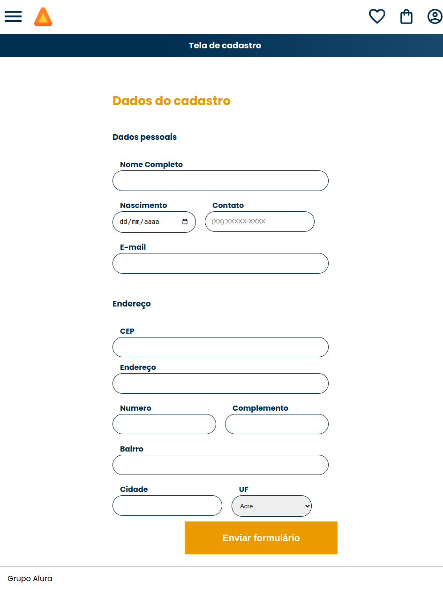

# Formulário AluraBooks

Um formulário que consome a API do ViaCEP, que serve para puxar o nome da rua, bairro, cidade e estado automaticamente .

| :placard: Vitrine.Dev |     |
| -------------  | --- |
| :sparkles: Nome        | **Formulário AluraBooks**
| :label: Tecnologias | HTML, CSS e JavaScript
| :rocket: URL         | https://formulario-alurabooks-three.vercel.app/
| :fire: Desafio     | -

## Detalhes do projeto

Projeto usando HTML, CSS e JavaScript com foco na prática de consumo de API e tratamento de dados de uma API Nesse projeto aprendi: 
 • Como funciona o JavaScript assíncrono;  
• Conheci as Promises e seus métodos;  
• Como utilizar async await para criar funções assíncronas;  
• Tratamento de possíveis erros de requisição retornados da API;  

## Screenshot

  </img>

